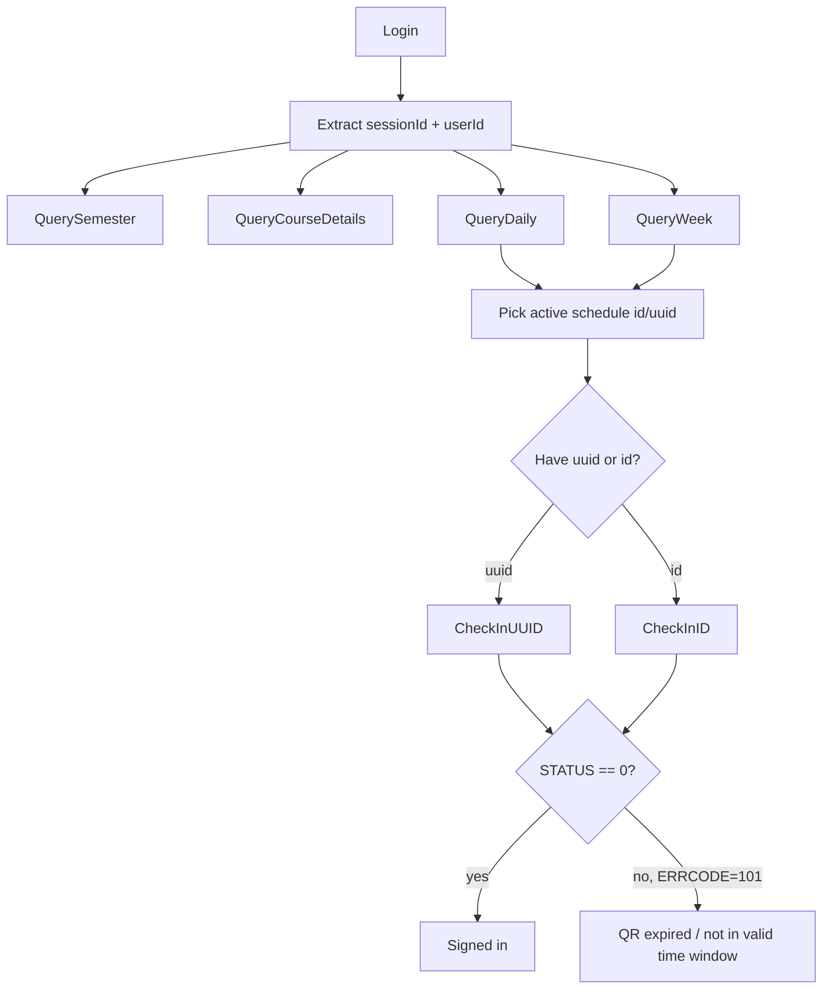

# UCAS iCLASS agent runtime model

## 1. Minimal execution graph



## 2. Practical execution policy

1. Login first and cache `sessionId` + `id`.
2. Use `QueryDaily(dateStr=YYYYMMDD)` or `QueryWeek(dateStr=YYYYMMDD)` to find today's schedule rows.
3. Choose the row whose current time is closest to or inside `[classBeginTime, classEndTime]`.
4. Attempt check-in:
   - with `timeTableId=<row.uuid>` when you have a UUID-oriented workflow
   - with `courseSchedId=<row.id>` when you have an ID-oriented workflow
5. Interpret responses:
   - `STATUS == "0"` => success
   - `STATUS == "1" && ERRCODE == "101"` => QR / sign-in window invalid or expired
   - other nonzero status => treat as business error and surface `ERRCODE` + `ERRMSG`

## 3. Canonical response shapes

### Login success
```json
{
  "STATUS": "0",
  "result": {
    "id": "<USER_ID>",
    "sessionId": "<SESSION_ID>",
    "userName": "<USER_ACCOUNT>",
    "realName": "<USER_NAME>"
  }
}
```

### Daily schedule success
```json
{
  "STATUS": "0",
  "total": "<N>",
  "result": [
    {
      "id": "<SCHEDULE_ID>",
      "uuid": "<SCHEDULE_UUID>",
      "courseName": "<COURSE_NAME>",
      "teacherName": "<TEACHER_NAME>",
      "classroomName": "<CLASSROOM_NAME>",
      "teachTime": "YYYY-MM-DD",
      "classBeginTime": "YYYY-MM-DD HH:MM:SS",
      "classEndTime": "YYYY-MM-DD HH:MM:SS"
    }
  ]
}
```

### Check-in success (from third-party code)
```json
{
  "STATUS": "0",
  "result": {
    "stuSignId": "<CHECKIN_RECORD_ID>",
    "stuSignStatus": "1"
  }
}
```

### Check-in failure (observed in your captured data)
```json
{
  "STATUS": "1",
  "ERRCODE": "101",
  "ERRMSG": "二维码已失效！"
}
```

## 4. Important caveats inferred from your data

- The observed `semesterName` inside some schedule/course payloads looks stale (`2014-2015第一学期`) even though `teachTime`, `beginDate`, `endDate` are in 2026. Use the date fields as truth.
- Both check-in variants in the captured collection hit the same path `/app/course/stu_scan_sign.action`.
- The difference between the two check-in modes is the query key:
  - UUID mode: `timeTableId`
  - ID mode: `courseSchedId`
- The failed check-ins are consistent with “not yet valid / expired QR” rather than “bad session”, because both variants returned the same business error payload.

## 5. Recommended machine-execution abstraction

Treat the system as four resource families:

- `session`: login and cache auth material
- `semesters`: school-year lookup
- `courses`: my enrolled courses
- `schedules`: daily / weekly class rows
- `attendance`: check-in attempts

This means an agent can expose a tiny tool surface like:

```ts
login(account, password) -> Session
getSemesters(userId) -> Semester[]
getMyCourses(sessionId, userId) -> Course[]
getDailySchedule(sessionId, userId, dateStr) -> ScheduleRow[]
getWeeklySchedule(sessionId, userId, dateStr) -> WeeklyDay[]
checkInByUUID(sessionId, userId, scheduleUUID, timestamp) -> CheckInResult
checkInByID(sessionId, userId, scheduleId, timestamp) -> CheckInResult
```
